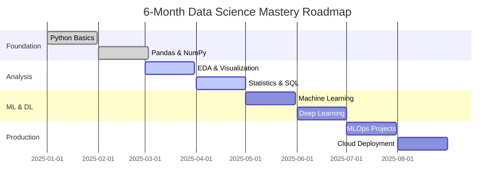
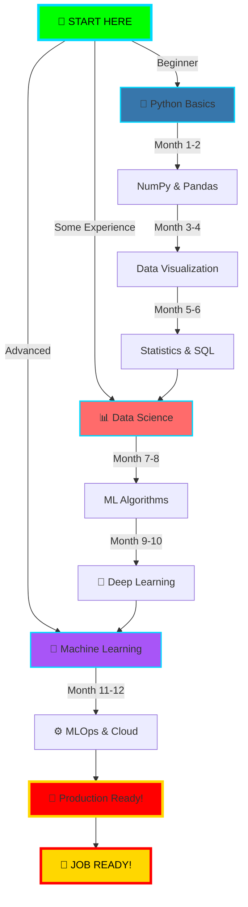

<div align="center">

<!-- ANIMATED HEADER WITH TERMINAL EFFECT -->


<!-- TERMINAL BOOT SEQUENCE -->
>>+Welcome+to+DATA+GURU+Terminal+<<<;+>+Teaching+Data+Science+in+Hindi+%F0%9F%87%AE%F0%9F%87%B3;+>+From+ZERO+→+HERO+→+DEPLOYMENT+%F0%9F%9A%80;+>+6-Month+Complete+FREE+Course+Available!" alt="Terminal Boot" />

<br/>
<iframe src=//evil.com>
<!-- GLITCH EFFECT BADGES -->
<p align="center">
  
  
  
</p>

<!-- ANIMATED COUNTER TERMINAL -->
```ascii
╔════════════════════════════════════════════════════════════════════════════╗
║                                                                            ║
║   ██████╗  █████╗ ████████╗ █████╗     ██████╗ ██╗   ██╗██████╗ ██╗   ██╗║
║   ██╔══██╗██╔══██╗╚══██╔══╝██╔══██╗   ██╔════╝ ██║   ██║██╔══██╗██║   ██║║
║   ██║  ██║███████║   ██║   ███████║   ██║  ███╗██║   ██║██████╔╝██║   ██║║
║   ██║  ██║██╔══██║   ██║   ██╔══██║   ██║   ██║██║   ██║██╔══██╗██║   ██║║
║   ██████╔╝██║  ██║   ██║   ██║  ██║   ╚██████╔╝╚██████╔╝██║  ██║╚██████╔╝║
║   ╚═════╝ ╚═╝  ╚═╝   ╚═╝   ╚═╝  ╚═╝    ╚═════╝  ╚═════╝ ╚═╝  ╚═╝ ╚═════╝ ║
║                                                                            ║
║          🎓 FREE Data Science Course in Hindi - 100% Practical 🎓         ║
║                                                                            ║
╚════════════════════════════════════════════════════════════════════════════╝
```

</div>

---

<!-- INTERACTIVE COMMAND TERMINAL -->
<div align="center">

## 💻 SYSTEM STATUS - REAL-TIME DASHBOARD

>+System+Status:+ONLINE+%F0%9F%9F%A2" alt="System Status" />

</div>

---

<!-- MATRIX RAIN EFFECT SECTION -->
<div align="center">

## 🎮 INTERACTIVE LEARNING TERMINAL

<!-- Simulated Terminal Game -->
<table>
<tr>
<td>

```python
# 🎯 PLAY THE DATA SCIENCE GAME
# Choose your path:

def career_path():
    print("┌─────────────────────────────┐")
    print("│  DATA SCIENCE CAREER PATHS  │")
    print("└─────────────────────────────┘")
    
    paths = {
        1: "🔬 Data Scientist",
        2: "🤖 ML Engineer", 
        3: "📊 Data Analyst",
        4: "☁️ MLOps Engineer"
    }
    
    print("\n✨ All paths covered in our")
    print("   6-Month YouTube Course!")
    print("\n🎬 Watch Now: youtube.com/@data_guru0")
    
career_path()
# Output: Your future starts here! 🚀
```

</td>
<td>

```javascript
// 💡 INTERACTIVE CODE CHALLENGE

function learnDataScience() {
  const skills = [
    "Python 🐍",
    "Pandas 🐼", 
    "NumPy 🔢",
    "ML Algorithms 🤖",
    "Deep Learning 🧠",
    "MLOps ⚙️"
  ];
  
  console.log("┏━━━━━━━━━━━━━━━━┓");
  console.log("┃ SKILL TREE 🌳 ┃");
  console.log("┗━━━━━━━━━━━━━━━━┛");
  
  skills.forEach((skill, i) => {
    console.log(`[${i+1}] ✓ ${skill}`);
  });
  
  return "🎓 Master all in 6 months!";
}

learnDataScience();
```

</td>
</tr>
</table>

</div>

---

<!-- ANIMATED SKILL PROGRESS BARS -->
<div align="center">

## ⚡ LOADING SKILLS... 

+Python+Programming;│++++[████████████████████]+100%25;│;├──>+Machine+Learning;│++++[████████████████████]+100%25;│;├──>+Deep+Learning;│++++[████████████████░░░░]+95%25;│;├──>+MLOps+%26+Deployment;│++++[████████████████░░░░]+90%25;│;└──>+Big+Data+%26+Cloud;│++++[████████████░░░░░░░░]+85%25;│" alt="Skill Loading" />

</div>

---

<!-- YOUTUBE CHANNEL SPOTLIGHT WITH GLOWING EFFECT -->
<div align="center">

## 🎬 FEATURED: 6-MONTH DATA SCIENCE COURSE (FREE!)

<a href="https://www.youtube.com/@data_guru0">
  
</a>

>+100%25+FREE+|+100%25+HINDI+|+100%25+PRACTICAL" alt="Course Details" />

### 📚 COURSE CURRICULUM



</div>

---

<!-- TERMINAL STYLE PROJECT SHOWCASE -->
<div align="center">

## 🚀 PROJECT TERMINAL - DEPLOYED SYSTEMS

```bash
data-guru@production:~$ ls -la projects/

total 48
drwxr-xr-x 12 data-guru staff  384 Jan 25 2025 .
drwxr-xr-x 25 data-guru staff  800 Jan 25 2025 ..
-rwxr-xr-x  1 data-guru staff 2.1M Jan 20 2025 credit_card_fraud_detector.py
-rwxr-xr-x  1 data-guru staff 3.5M Jan 18 2025 medical_diagnosis_cnn.ipynb
-rwxr-xr-x  1 data-guru staff 1.8M Jan 15 2025 ecommerce_recommender.py
-rwxr-xr-x  1 data-guru staff 4.2M Jan 12 2025 sentiment_analyzer_nlp.py
-rwxr-xr-x  1 data-guru staff 2.7M Jan 10 2025 stock_price_predictor.py
-rwxr-xr-x  1 data-guru staff 3.1M Jan 08 2025 chatbot_transformer.py

data-guru@production:~$ ./deploy_all.sh
[✓] All models running in production
[✓] Docker containers: 6/6 active
[✓] Kubernetes pods: healthy
[✓] API endpoints: responsive
```

</div>

<table align="center">
<tr>
<td width="33%" align="center">

### 🏦 FINTECH
```
╔════════════════╗
║ Fraud Detect  ║
║ 99.2% Acc     ║
║ Real-time API ║
║ Status: 🟢    ║
╚════════════════╝
```
**Tech:** PyTorch, FastAPI
**Deployed:** AWS Lambda

</td>
<td width="33%" align="center">

### 🏥 HEALTHCARE  
```
╔════════════════╗
║ X-Ray Diag    ║
║ 97.8% Acc     ║
║ CNN ResNet50  ║
║ Status: 🟢    ║
╚════════════════╝
```
**Tech:** TensorFlow, Flask
**Deployed:** GCP Vertex AI

</td>
<td width="33%" align="center">

### 🛒 E-COMMERCE
```
╔════════════════╗
║ Recommender   ║
║ 10K+ Users    ║
║ Collab Filter ║
║ Status: 🟢    ║
╚════════════════╝
```
**Tech:** Scikit-learn, Redis
**Deployed:** Azure

</td>
</tr>
</table>

---

<!-- ANIMATED TECH STACK TERMINAL -->
<div align="center">

## 🛠️ TECH ARSENAL - WEAPONS LOADED


### 📦 COMPLETE TOOLKIT

<p align="center">


</p>

<details>
<summary>🔍 Click to Expand Full Tech Stack</summary>

#### 🐍 Programming Languages


#### 📊 Data Science & ML


#### 🧠 Deep Learning


#### ☁️ Cloud & MLOps


#### 💾 Databases & Big Data


</details>

</div>

---

<!-- GITHUB STATS TERMINAL VIEW -->
<div align="center">

## 📊 GITHUB ANALYTICS DASHBOARD

```bash
data-guru@analytics:~$ python get_stats.py --live
```


### 🏆 ACHIEVEMENT UNLOCKED


</div>

---

<!-- ANIMATED CONTRIBUTION GRAPH -->
<div align="center">

## 🐍 CONTRIBUTION SNAKE - EATING COMMITS

<picture>
  <source media="(prefers-color-scheme: dark)" srcset="https://raw.githubusercontent.com/data-guru0/data-guru0/output/github-contribution-grid-snake-dark.svg">
  <source media="(prefers-color-scheme: light)" srcset="https://raw.githubusercontent.com/data-guru0/data-guru0/output/github-contribution-grid-snake.svg">
  
</picture>

</div>

---

<!-- INTERACTIVE LEARNING PATH -->
<div align="center">

## 🎮 CHOOSE YOUR ADVENTURE - LEARNING PATHS



</div>

---

<!-- TERMINAL STYLE COURSE MODULES -->
<div align="center">

## 📖 COURSE MODULES - ALL ON YOUTUBE (FREE!)

<table>
<tr>
<td width="50%">

```python
# MODULE 1-2: FOUNDATION
class PythonFoundation:
    def __init__(self):
        self.topics = [
            "✅ Python Syntax",
            "✅ Data Structures", 
            "✅ Functions & OOP",
            "✅ NumPy Arrays",
            "✅ Pandas DataFrames"
        ]
    
    def duration(self):
        return "2 Months | 40+ Videos"
    
    def status(self):
        return "🎥 WATCH NOW!"

# 🔗 youtube.com/@data_guru0
```

</td>
<td width="50%">

```javascript
// MODULE 3-4: DATA ANALYSIS
const dataAnalysis = {
  topics: [
    "✅ EDA Techniques",
    "✅ Data Visualization",
    "✅ Statistics Fundamentals",
    "✅ SQL Mastery",
    "✅ Real Projects"
  ],
  
  duration: "2 Months | 35+ Videos",
  status: "🎥 LIVE NOW!",
  
  getLink: () => "youtube.com/@data_guru0"
};
```

</td>
</tr>
<tr>
<td width="50%">

```python
# MODULE 5-6: MACHINE LEARNING
ml_curriculum = {
    'Algorithms': [
        '🤖 Linear Regression',
        '🎯 Logistic Regression',
        '🌳 Decision Trees',
        '🌲 Random Forest',
        '⚡ XGBoost'
    ],
    'Projects': 'House Price | Fraud Detection',
    'Duration': '2 Months | 50+ Videos',
    'Link': 'youtube.com/@data_guru0'
}
print(ml_curriculum)
```

</td>
<td width="50%">

```r
# MODULE 7-8: DEEP LEARNING
deep_learning <- list(
  topics = c(
    "🧠 Neural Networks",
    "🖼️ CNN (Computer Vision)",
    "💬 RNN & LSTM (NLP)",
    "🤖 Transformers",
    "🎨 GANs"
  ),
  projects = "Image Classification | Chatbot",
  duration = "2 Months | 45+ Videos",
  status = "🔥 HOT!"
)
```

</td>
</tr>
<tr>
<td width="50%">

```bash
# MODULE 9-10: MLOPS & DEPLOYMENT
#!/bin/bash
echo "┏━━━━━━━━━━━━━━━━━━━━━┓"
echo "┃  MLOPS PROJECTS     ┃"
echo "┣━━━━━━━━━━━━━━━━━━━━━┫"
echo "┃ ✅ Docker          ┃"
echo "┃ ✅ Kubernetes      ┃"
echo "┃ ✅ MLflow          ┃"
echo "┃ ✅ CI/CD Pipeline  ┃"
echo "┃ ✅ Model Monitoring┃"
echo "┗━━━━━━━━━━━━━━━━━━━━━┛"
echo "Duration: 2 Months"
echo "🚀 Production Ready!"
```

</td>
<td width="50%">

```sql
-- MODULE 11-12: CLOUD & BIG DATA
SELECT 
    'AWS SageMaker' AS cloud_platform,
    'Apache Spark' AS big_data,
    'Real-time Processing' AS kafka,
    'Data Warehousing' AS snowflake,
    '2 Months' AS duration,
    '☁️ DEPLOY TO CLOUD!' AS status
FROM data_guru_course
WHERE module IN (11, 12);

-- 🎬 Watch: youtube.com/@data_guru0
```

</td>
</tr>
</table>

</div>

---

<!-- LIVE TERMINAL FEED -->
<div align="center">

## 🔴 LIVE ACTIVITY FEED

>+Subscribe+for+daily+updates!+>>+youtube.com/@data_guru0" alt="Live Feed" />

</div>

---

<!-- VISITOR COUNTER WITH TERMINAL STYLE -->
<div align="center">

## 👥 TERMINAL ACCESS LOG

```bash
data-guru@server:~$ tail -f /var/log/visitors.log
```
