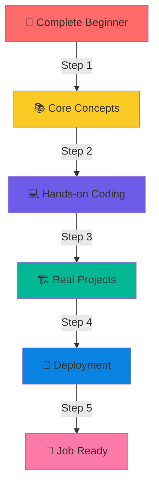
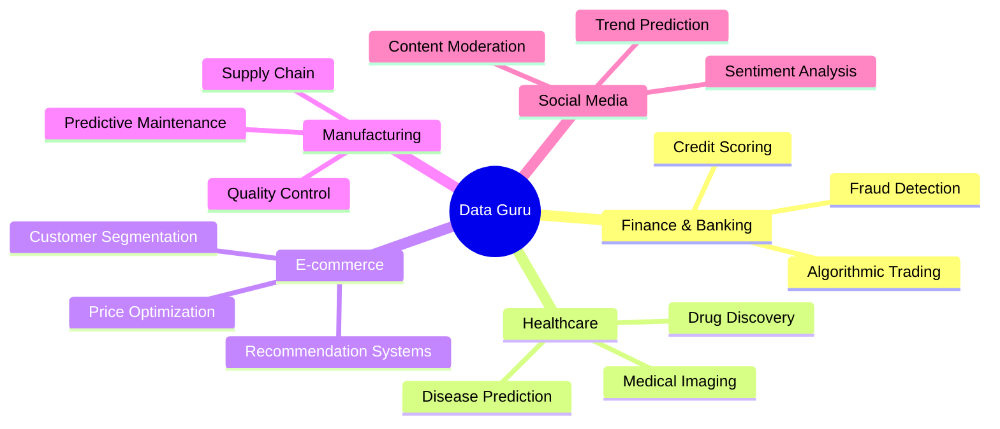
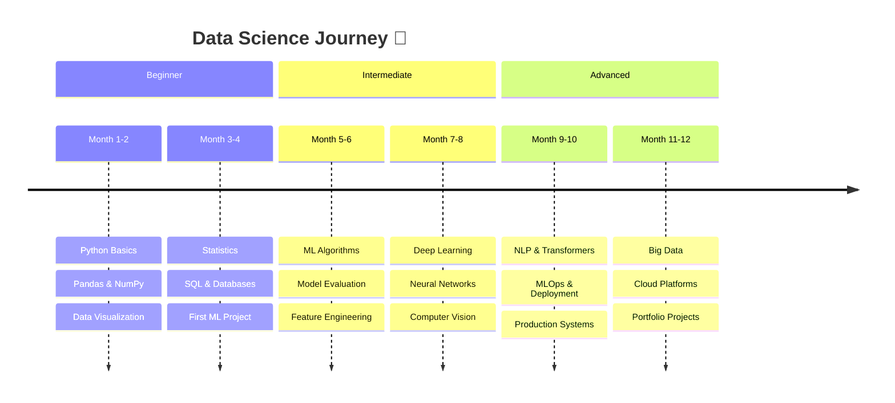

<div align="center">


<p align="center">
  
  
  
</p>

---

### 🎯 Mission Statement

```ascii
╔══════════════════════════════════════════════════════════════════╗
║  "Democratizing Data Science Education Through Simple Hindi"    ║
║                                                                  ║
║  Making Complex Tech → Simple to Understand → Easy to Apply    ║
╚══════════════════════════════════════════════════════════════════╝
```

</div>

---

## 🌟 What Makes This Different?

<table>
<tr>
<td width="50%">

### 🎓 Learning Philosophy



</td>
<td width="50%">

### 🔥 Core Focus Areas

<div align="center">

| Domain | Stack | Level |
|--------|-------|-------|
| 📊 **Data Science** | Python, Pandas, NumPy | 🟢🟢🟢🟢🟢 |
| 🤖 **Machine Learning** | Scikit-learn, TensorFlow | 🟢🟢🟢🟢🟢 |
| 🧠 **Deep Learning** | PyTorch, Keras, CNNs | 🟢🟢🟢🟢⚪ |
| ☁️ **MLOps** | Docker, K8s, MLflow | 🟢🟢🟢🟢⚪ |
| 💾 **Big Data** | Spark, Hadoop, Kafka | 🟢🟢🟢⚪⚪ |

</div>

</td>
</tr>
</table>

---

## 🎬 YouTube Channel - Free Hindi Tutorials

<div align="center">

<a href="https://youtube.com/@UCYJJtmZyW_zP_3hfCMp-EsQ">
  
</a>

[](https://youtube.com/@UCYJJtmZyW_zP_3hfCMp-EsQ)
[](https://youtube.com/@UCYJJtmZyW_zP_3hfCMp-EsQ)


</div>

---

## 🏗️ Industry Domains Covered

<div align="center">



</div>

<table align="center">
<tr>
<td align="center" width="20%">
<br/>
<b>Finance</b><br/>
<sub>Credit Risk, Fraud</sub>
</td>
<td align="center" width="20%">
<br/>
<b>Healthcare</b><br/>
<sub>Diagnostics, Imaging</sub>
</td>
<td align="center" width="20%">
<br/>
<b>E-commerce</b><br/>
<sub>Recommendations</sub>
</td>
<td align="center" width="20%">
<br/>
<b>Manufacturing</b><br/>
<sub>Predictive Maintenance</sub>
</td>
<td align="center" width="20%">
<br/>
<b>Social Media</b><br/>
<sub>Sentiment Analysis</sub>
</td>
</tr>
</table>

---

## 🚀 Tech Stack & Tools

### Programming & Data Science
<p align="center">
  
</p>

### Machine Learning & AI
<p align="center">
  
  
  
  
</p>

### Big Data & Cloud
<p align="center">
  
  
  
  
</p>

### Databases & Tools
<p align="center">
  
</p>

### MLOps & Deployment
<p align="center">
  
  
  
  
</p>

### Visualization & Notebooks
<p align="center">
  
  
  
  
</p>

---

## 📊 GitHub Analytics

<div align="center">


</div>

### 🏆 GitHub Trophies

<div align="center">


</div>

---

## 🐍 Contribution Snake Animation

<div align="center">

<picture>
  <source media="(prefers-color-scheme: dark)" srcset="https://raw.githubusercontent.com/dataguru/dataguru/output/github-contribution-grid-snake-dark.svg">
  <source media="(prefers-color-scheme: light)" srcset="https://raw.githubusercontent.com/dataguru/dataguru/output/github-contribution-grid-snake.svg">
  
</picture>

</div>

---

## 📈 Contribution Activity Graph

<div align="center">

[](https://github.com/dataguru)

</div>

---

## 🎓 Learning Roadmap

<div align="center">



</div>

---

## 💡 Featured Projects

<div align="center">

<table>
<tr>
<td width="50%">

### 🎯 Real-time Projects

- 🏦 **Credit Card Fraud Detection**
  - Deep Learning with Imbalanced Data
  - 99.2% Accuracy | Production Ready
  
- 🏥 **Medical Diagnosis System**
  - CNN for X-ray Analysis
  - Transfer Learning | ResNet50

- 🛒 **E-commerce Recommender**
  - Collaborative Filtering
  - Real-time Recommendations

</td>
<td width="50%">

### 🚀 MLOps Implementations

- 🐳 **Docker + Kubernetes**
  - Model Containerization
  - Auto-scaling Deployments
  
- ☁️ **AWS/GCP Deployment**
  - SageMaker | Vertex AI
  - CI/CD Pipelines

- 📊 **Monitoring & Logging**
  - Prometheus | Grafana
  - Model Performance Tracking

</td>
</tr>
</table>

</div>

---

## 🌐 Connect & Learn Together

<div align="center">

<a href="https://youtube.com/@UCYJJtmZyW_zP_3hfCMp-EsQ">
  
</a>
<a href="https://linkedin.com/in/dataguru">
  
</a>
<a href="https://twitter.com/dataguru">
  
</a>
<a href="https://instagram.com/dataguru">
  
</a>
<a href="mailto:contact@dataguru.com">
  
</a>

<br/><br/>

### 💬 Join Our Community


</div>

---

## 📌 Quick Links

<div align="center">

| 📚 Resource | 🔗 Link | 📝 Description |
|-------------|---------|----------------|
| 🎥 **Video Tutorials** | [YouTube Playlist](https://youtube.com/@UCYJJtmZyW_zP_3hfCMp-EsQ) | Complete ML Course in Hindi |
| 💻 **Code Repository** | [GitHub Repos](https://github.com/dataguru) | All Project Source Code |
| 📖 **Blog & Articles** | [Medium/Blog](#) | In-depth Technical Guides |
| 🎓 **Free Resources** | [Resource Hub](#) | Datasets, Notebooks, PDFs |

</div>

---

## 🎯 Profile Views & Stats

<div align="center">


### 💫 Show Some Love

If you find my content helpful:
- ⭐ Star my repositories
- 🔔 Subscribe to my YouTube channel  
- 🤝 Share with others who want to learn
- 💖 Sponsor my work (optional)

<a href="https://www.buymeacoffee.com/dataguru">
  
</a>

</div>

---

<div align="center">

### ⚡ Random Dev Quote


### 😄 Random Dev Meme


---


</div>


---

<div align="center">

**"Education is the most powerful weapon which you can use to change the world."**  
*- Nelson Mandela*

**© 2025 Data Guru | Making Data Science Accessible in Hindi** 🇮🇳

</div>
